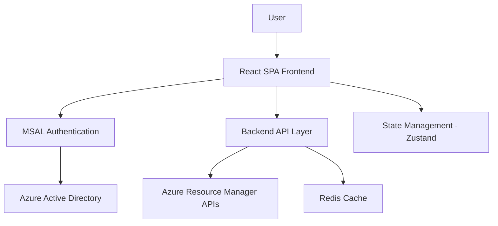

# Design Document

## Overview

The Azure VM Marketplace Browser is a modern single-page application (SPA) built with React/TypeScript that provides an intuitive interface for browsing Azure Marketplace VM images. The application leverages Microsoft Authentication Library (MSAL) for OAuth2/OIDC authentication and integrates with Azure Resource Manager APIs to retrieve VM image data in a hierarchical structure.

## Architecture

### High-Level Architecture



### Technology Stack

**Frontend:**
- React 18 with TypeScript
- Vite for build tooling
- Tailwind CSS for styling
- Zustand for state management
- React Router for navigation
- MSAL React for authentication

**Backend:**
- Node.js with Express
- TypeScript
- Redis for caching
- Azure SDK for JavaScript

## Components and Interfaces

### Frontend Components

#### Authentication Components
- `AuthProvider`: Wraps the application with MSAL context
- `LoginButton`: Handles OAuth2 login flow
- `ProtectedRoute`: Guards routes requiring authentication

#### Navigation Components
- `SubscriptionSelector`: Dropdown for subscription selection
- `Breadcrumb`: Navigation breadcrumb for Publisher → Offers → SKUs
- `SearchFilter`: Search and filter functionality within each level

#### Data Display Components
- `PublisherGrid`: Grid display of VM image publishers
- `OfferList`: List view of offers for selected publisher
- `SKUDetails`: Detailed view of SKUs with copy functionality
- `CopyButton`: Handles copying image details in various IaC formats

#### Utility Components
- `LoadingSpinner`: Loading states during API calls
- `ErrorBoundary`: Error handling and display
- `Pagination`: Handles large datasets

### Backend API Endpoints

```typescript
// Authentication & Authorization
GET /api/auth/subscriptions - Get user's accessible subscriptions

// VM Image Data
GET /api/vm-images/publishers?subscription={id} - Get all publishers
GET /api/vm-images/offers?subscription={id}&publisher={name} - Get offers for publisher
GET /api/vm-images/skus?subscription={id}&publisher={name}&offer={name} - Get SKUs for offer

// Utility
GET /api/vm-images/copy-format?format={type}&imageData={data} - Format image data for IaC
```

### State Management Structure

```typescript
interface AppState {
  auth: {
    isAuthenticated: boolean;
    user: User | null;
    subscriptions: Subscription[];
    selectedSubscription: string | null;
  };
  vmImages: {
    publishers: Publisher[];
    offers: Offer[];
    skus: SKU[];
    loading: boolean;
    error: string | null;
  };
  navigation: {
    currentLevel: 'publishers' | 'offers' | 'skus';
    selectedPublisher: string | null;
    selectedOffer: string | null;
    breadcrumb: BreadcrumbItem[];
  };
}
```

## Data Models

### Core Data Types

```typescript
interface Subscription {
  subscriptionId: string;
  displayName: string;
  state: string;
}

interface Publisher {
  name: string;
  displayName: string;
  location: string;
}

interface Offer {
  name: string;
  displayName: string;
  publisher: string;
  location: string;
}

interface SKU {
  name: string;
  displayName: string;
  publisher: string;
  offer: string;
  location: string;
  versions: string[];
}

interface VMImageReference {
  publisher: string;
  offer: string;
  sku: string;
  version: string;
}
```

### IaC Format Templates

```typescript
interface IaCFormats {
  arm: string;
  terraform: string;
  bicep: string;
  ansible: string;
}

interface CopyableImageData {
  imageReference: VMImageReference;
  formats: IaCFormats;
}
```

## Error Handling

### Authentication Errors
- Token expiration: Automatic refresh with fallback to re-authentication
- Permission errors: Clear messaging with guidance on required permissions
- Network errors: Retry logic with exponential backoff

### API Errors
- Rate limiting: Queue requests and show progress indicators
- Service unavailable: Graceful degradation with cached data when possible
- Invalid responses: Validation and error boundaries

### User Experience Errors
- Loading states: Skeleton screens and progress indicators
- Empty states: Helpful messaging when no data is available
- Network connectivity: Offline indicators and retry options

## Testing Strategy

### Unit Testing
- Component testing with React Testing Library
- State management testing with Zustand
- API service testing with Jest
- Authentication flow testing with MSAL mocks

### Integration Testing
- End-to-end authentication flows
- API integration with Azure services
- Cross-browser compatibility testing
- Responsive design testing

### Performance Testing
- Large dataset rendering performance
- API response time optimization
- Memory usage monitoring
- Bundle size optimization

## Security Considerations

### Authentication Security
- PKCE (Proof Key for Code Exchange) for OAuth2 flows
- Secure token storage using MSAL token cache
- Automatic token refresh handling
- Proper logout and session cleanup

### API Security
- Bearer token authentication for all API calls
- Input validation and sanitization
- Rate limiting implementation
- CORS configuration for production

### Data Protection
- No sensitive data stored in local storage
- Secure transmission over HTTPS
- Minimal data retention policies
- Audit logging for access patterns

## Performance Optimizations

### Frontend Optimizations
- Code splitting by route and feature
- Lazy loading of components
- Virtual scrolling for large lists
- Image optimization and lazy loading
- Service worker for caching static assets

### Backend Optimizations
- Redis caching for frequently accessed data
- Connection pooling for Azure API calls
- Response compression
- CDN integration for static assets

### API Optimizations
- Batch API calls where possible
- Pagination for large datasets
- Conditional requests with ETags
- Background data prefetching